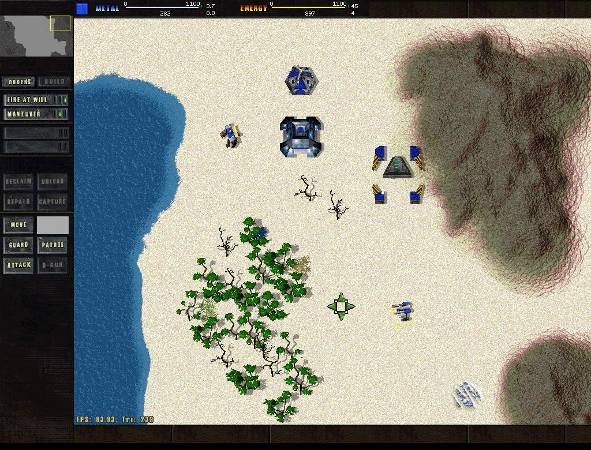

# nTA - A partial clone of Total Annihilation

This is a side project that I was working on while attending [TTU](https://www.ttu.edu) as an undergraduate in the early 2000's. The code was originally released to the public on [TA Universe](http://www.tauniverse.com)'s fourms ([see thread](http://www.tauniverse.com/forum/showthread.php?t=15783)).

nTA grew out of some tools that I had built for creating and editing Total Annihilation units. I think Scriptor (a unit script compiler) was the only one released publicly; but after cobbling together a unit viewer (with animations!), a map viewer, an hpi compressor, and so on, I eventually decided to just try and recreate the whole game (I was young and optimistic/naive).

Honestly, I have a big soft spot for this project and the other TA tools. I learned a lot about programming and software-engineering from working on these projects; and I credit this early work for getting me where I am in my tech career.

**Keep working on those passion projects kids!**

## Features
- Original UI
- Map Loading
- Model/Unit Rendering
- Pathfinding

## Major Missing Features
- Strategy AI
- Combat AI
- **Gameplay**
- Networking

## Getting Started

To run nTA, you will need an installed copy of Total Annihilation.

And then you'd need some kind of time-machine because I don't think nTA will work 'as-is' on any kind of modern machine.

nTA was written in Visual Studio 5/6 on Windows 2000. There is some serious code-rot in this project and it would take a major effort to make it runnable again.

## Future

I'd like to eventually get nTA runnable again as kind of a side-side-side project (re: I will almost certainly not have any time for this).

The first goal would be to get nTA compling and running on a modern Windows and Visaul Studio setup.

- Remove paletted texture requirement. I believe that paletted textures lost support over a decade ago.
- Audit STL code. The nTA code was originally written against a non-standard STL librabry, SGI's IIRC.

Beyond that, I mostly work on macOS these days so it would be great to get nTA working on that too.

- Get the OpenGL renderer working on a modern Mac.
- Replace the other Direct X componensts (input, sound) with a suitable Mac replacement.

## Dreaming
It would be pretty cool if this (or some fork) could become some kind of "Open Total Annihilation" open source project like [Free Civ](http://www.freeciv.org) or [openage](https://github.com/SFTtech/openage).

Also, playing TA on an iPad would be streets-ahead.
